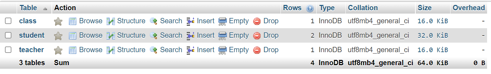
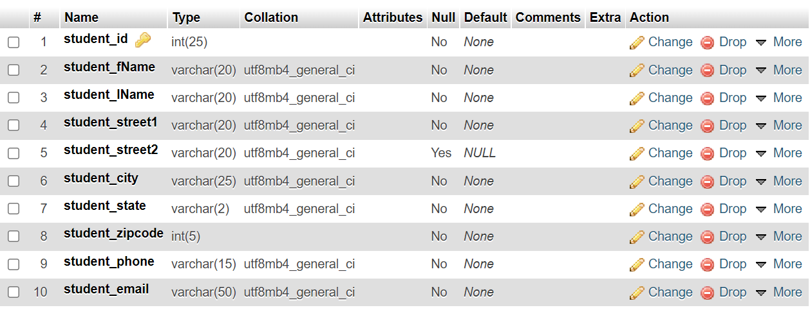

The Database
============

Creating the Database
---------------------

In order for the end user to pull the information they may need, whether it's a
teacher wanting to see their students and the grades, or the student wanting
to see what class they're enrolled in, a database is needed to collect that
information.

The database will have several tables in it to collect each piece of information
to be displayed on the site.  There is a table to collect each of the following:

1. Student

2. Teacher

3. Term

4. Class

5. Grade

So far, only the Class, Student, and Teacher tables have been created:

Database Tables
---------------
After building the capstone database, I started with creating the student table
which will allow student records to be inserted.

Connecting Database to the Website
----------------------------------
Since the database has now been created and setup, a connection from the website
to the database is needed.  Without this, no records will be entered into any
of the tables, meaning nothing will show up when pulling the query.

.. code-block:: php

      <?php
        $servername = "localhost";
        $username = "mshiemstra";
        $password = "June6187!";
        $database = "capstone";

        $conn = mysqli_connect($servername, $username, $password, $database);

        if ($conn->connect_error) {
            die("Connection failed: " . $conn->connect_error);
        }
    ?>

