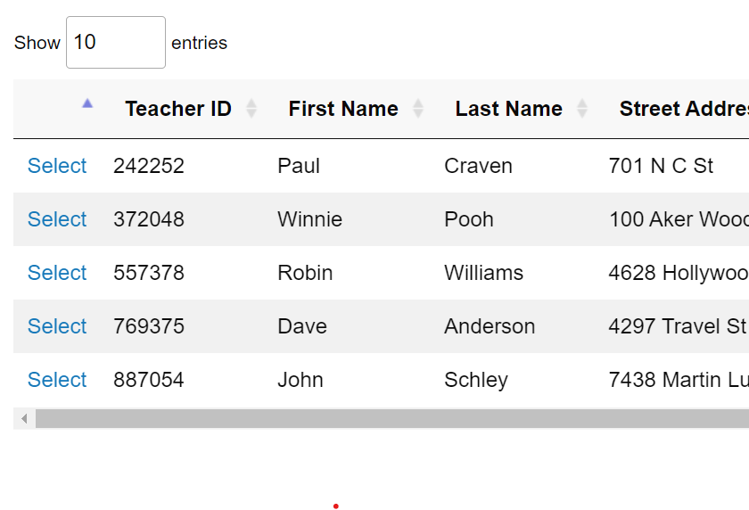
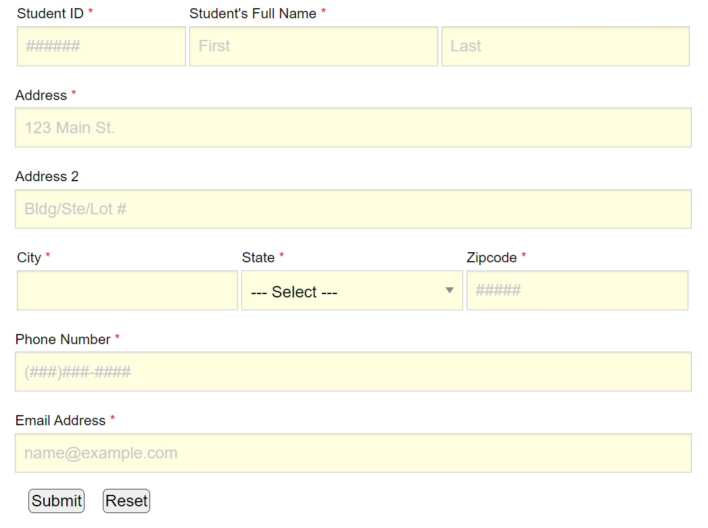

Beginning Finalization
======================

As time grows closer to the end of the of the semester, we need to start wrapping
things up.  For instance, if there were any functions that need to be working,
now is the time to do that. In my case, I had a lot of updates I needed to complete
as far as the form functions and overall style of the site.

At the beginning of the semester, I had the idea of building a user friendly
interface that anyone who attended Simpson College could use to keep track of
their classes, their teachers and/or their students.  With a lot of work, I feel
I have achieved that.  Of course there is still plenty more I'd like to do with
the site before I feel comfortable including it on my portfolio site, but that's
the beauty about Web Development; you're never completely finished.

Before turning in this project for the Capstone assignment, I went through each
of the forms and data tables and confirmed they are working.  I updated the tables
to a more modern, sheek, look that clearly displays the data a student or teacher
may find useful while attending or teaching at Simpson.

Here is an example of what the new updated data tables look like:

Here is an example of what the new forms look like:

I am still planning on tweaking a few things before I call it good on this project
to meet (and hopefully exceed) the requirements of the course, then in my own time,
I will work on creating a login structure so teachers can see information relevant
to only teachers, and students can see information that's only relevant and available
for a student to view.
