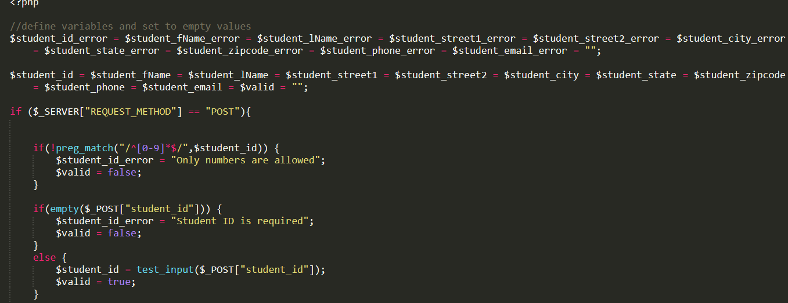

Form Validation and Security
----------------------------
I added a formHandling.php sheet which contains all of the form security and
validations, and a formValidations.js sheet to assist with initial security
(real time warnings if fields aren't filled out correctly).

A short example of the formHandling.php is:

I also added form validations to the Student Table, checking to ensure each field
is filled out correctly and in the correct formats.  Below is an example of using
regular expressions to verify a value has been entered in the input box, and
only letters and whitespaces are entered in the First Name field.

.. code-block:: PHP

        if (empty($_POST["student_fName"])){
			$student_fName_error = "Student's first name is required";
		}
        else {
			$student_fName = student_input($_POST["student_fName"]);
		   		if (!preg_match("/^[a-zA-Z-' ]*$/",$student_fName)) {
                  $student_fName_error = "Only letters and white space allowed";
                }
		}

A short example of the formValidations.js is:

.. code-block:: javascript

        function student_firstName() {
          let student_fName = document.getElementById("student_fName").value;

          let patt = new RegExp(/^[a-zA-Z -]*$/);
          let res = patt.exec(student_fName);

          if(student_fName == "" || student_fName == null || student_fName == "null" || student_fName == undefined || student_fName == "undefined" || res == null) {

            document.getElementById("error2").innerHTML = "Please enter a valid first name";
            document.getElementById("student_fName").style.border = "1px solid red";
            return validForm = false;
          }
          else {
            document.getElementById("error2").innerHTML = "";
            document.getElementById("student_fName").style.borderTop = "2px solid #BDBDBD";
            document.getElementById("student_fName").style.borderLeft = "1px solid #BDBDBD";
            document.getElementById("student_fName").style.borderBottom = "1px solid #BDBDBD";
            document.getElementById("student_fName").style.borderRight = "1px solid #BDBDBD";

            return validForm = true;
          }
      }
